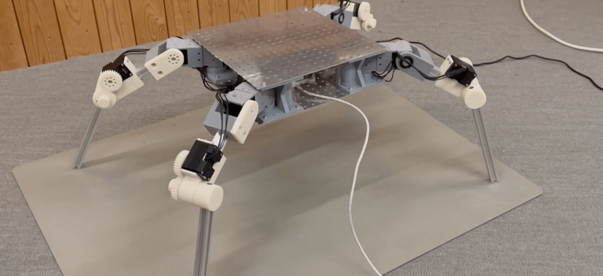

# cps-software
Software artifacts and documentation for cyber-physical systems projects.

## Projects
[projects](projects) contains folders with files specific to each project. There are currently two projects included: 

### [Spider](projects/spider) 

Quadruped robot. The folder for this project contains: 
* Assembly instructions.
* Bill of materials. 
* Source code to control the robot

### [Ship-To-Shore Crane](projects/sts-crane) 
Prototype of a [Ship-To-Shore Crane](https://en.wikipedia.org/wiki/Container_crane). This work is in progress, and neither the software nor the documentation is thus completed.  

## Library
[lib](lib) contains library code for motors and sensors used by the projects. In specific, library code for these motors and sensors are included: 
* Accelerometer/gyroscope (mpu6050)
* Raspberry PI Camera
* Distance sensor (US-100)
* Dynamixel motors

## CAD-files
CAD-files for the different projects can be found in the [cps-cad](https://github.com/miking-lang/cps-cad)-repository.
