# Parts for the Spider
## 3D-printed Parts
|Picture|Qty.|Weight|Description|
|---|---|---|---|
|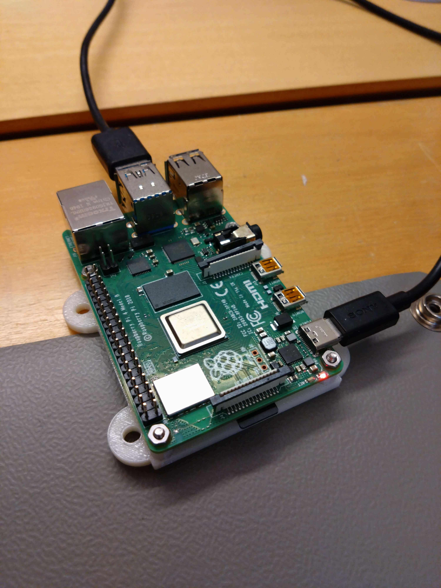|1x|50 g (including RPi)|RPi with attachment|
|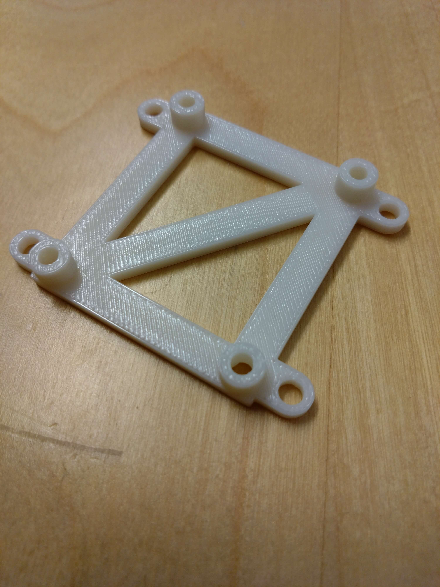|1x|8 g|power hub attachment|
|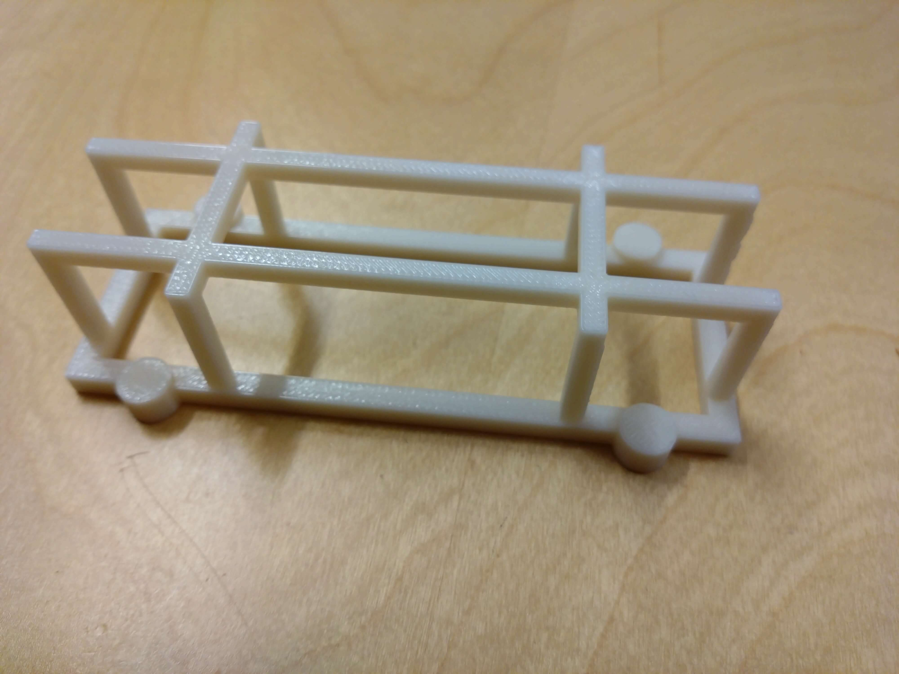|1x|15 g|battery case|
|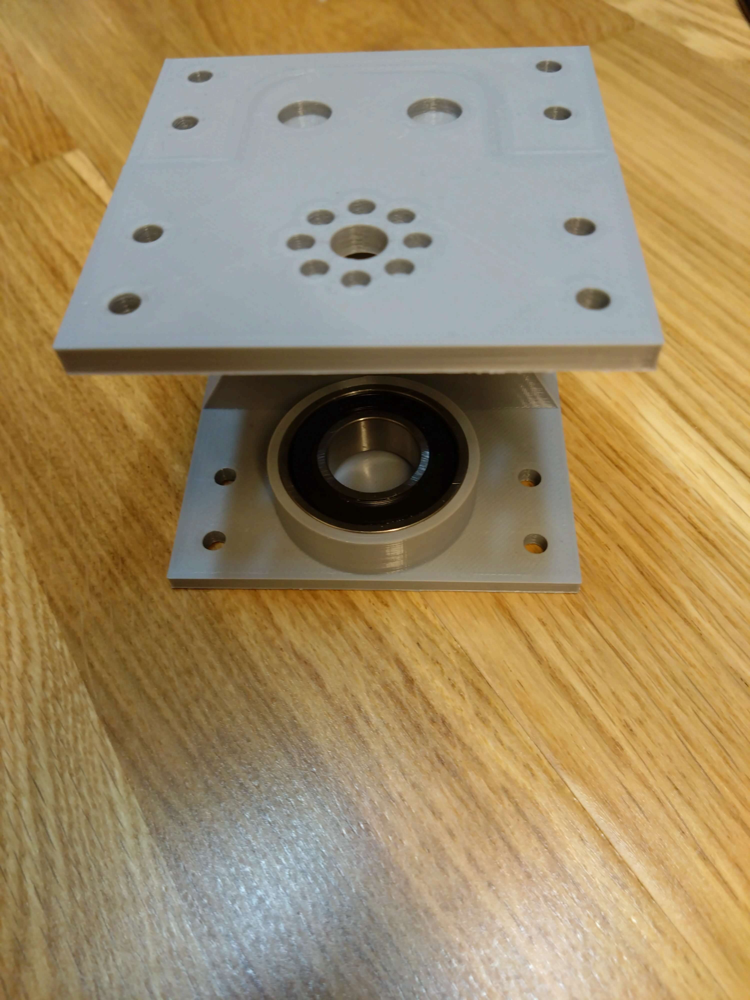|4x|151 g (including ball bearing)|shoulder part|
|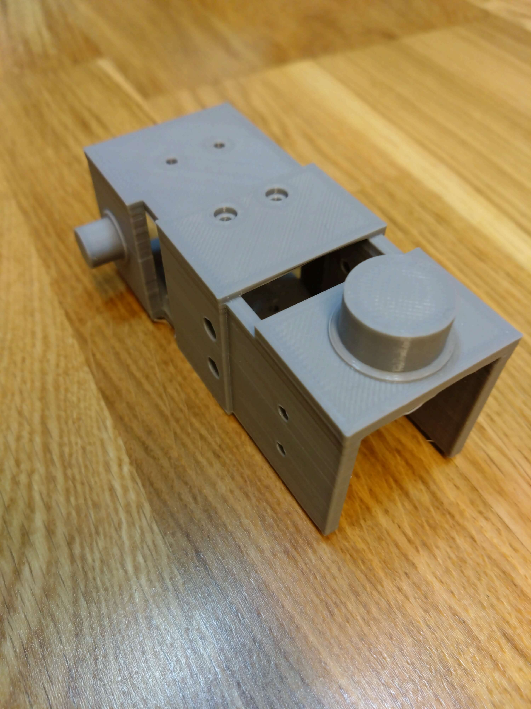|4x|30 g|shoulder part|
|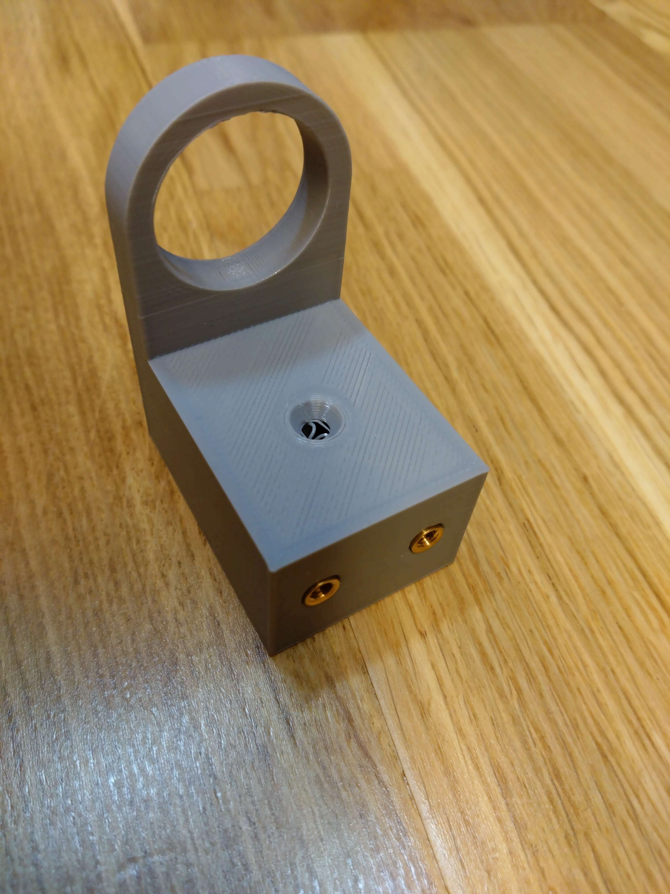|4x|31 g|shoulder part with threaded inserts|
|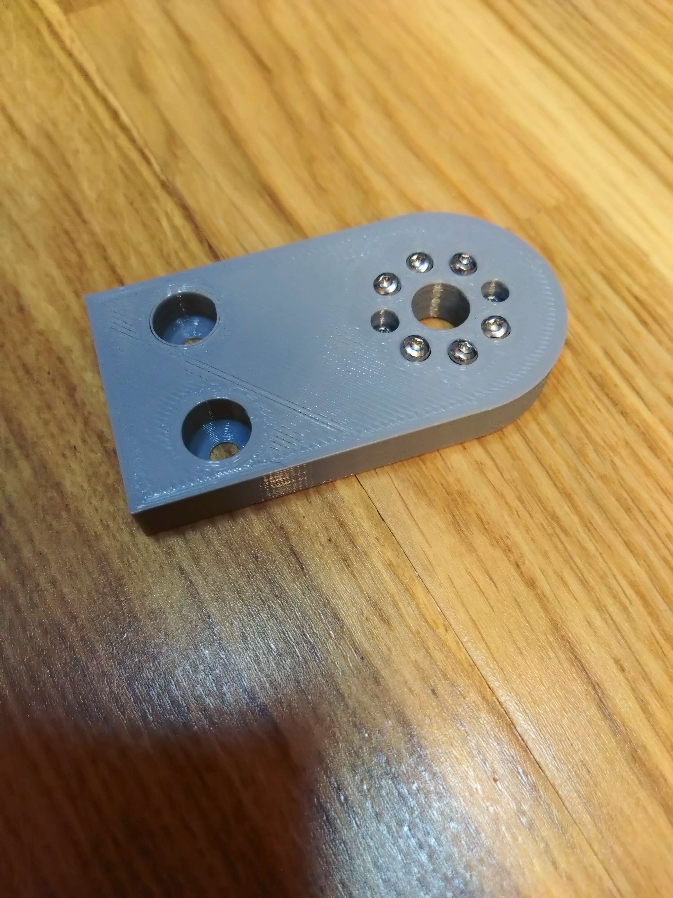|4x|13 g (including screws)|shoulder part with 8 screws|
|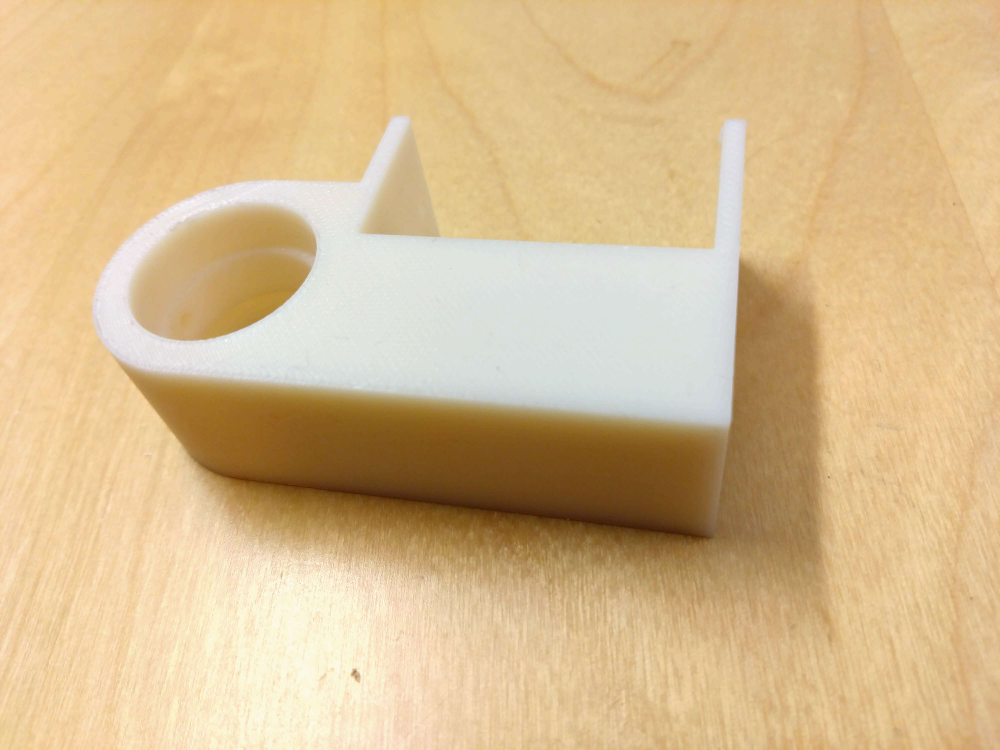|4x|39 g*|elbow part|
|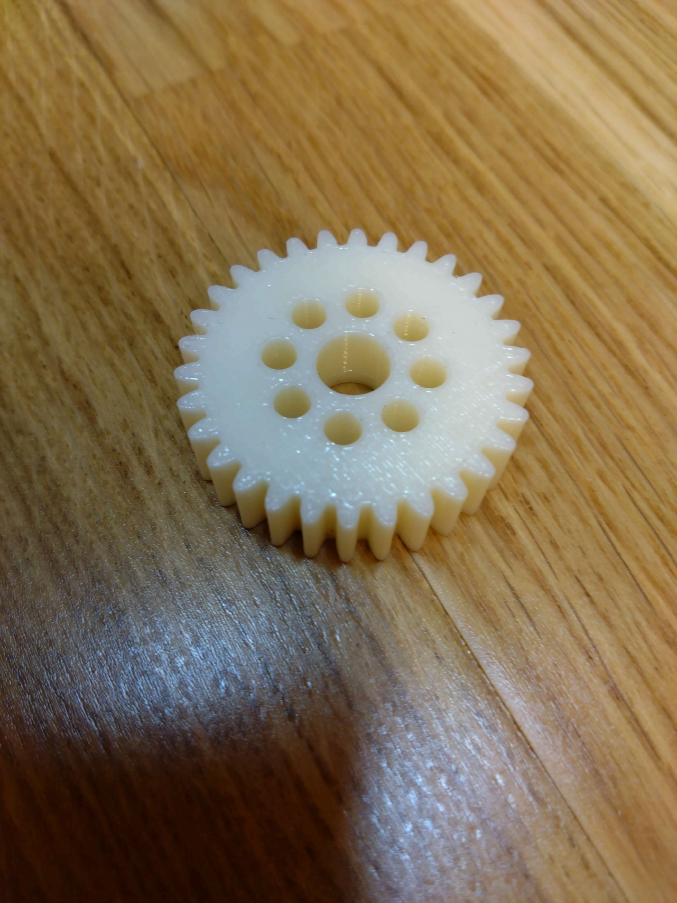|4x|7 g|servo gear|
|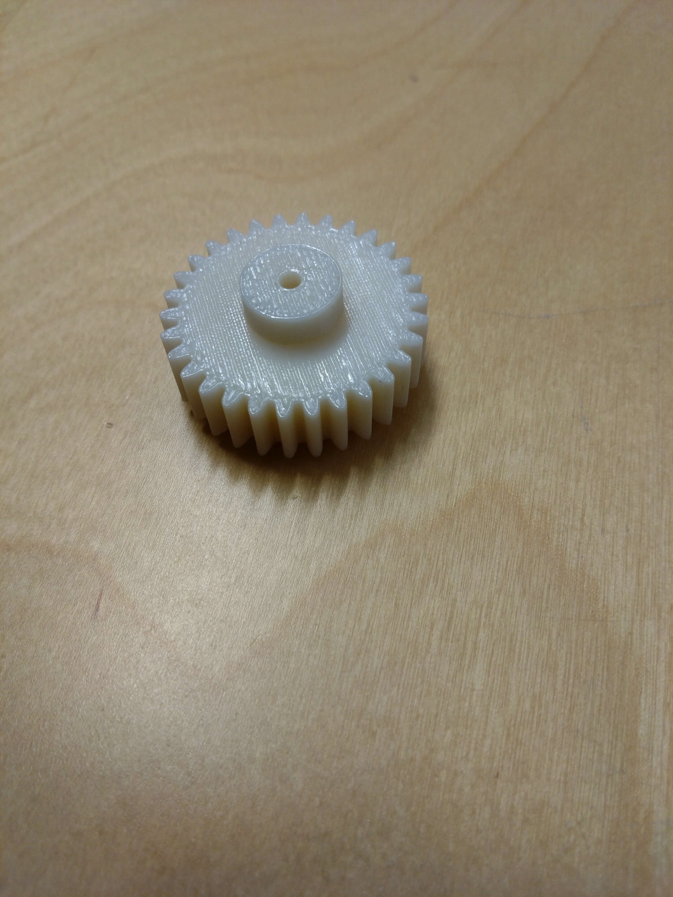|4x|8 g|cylinder gear|
|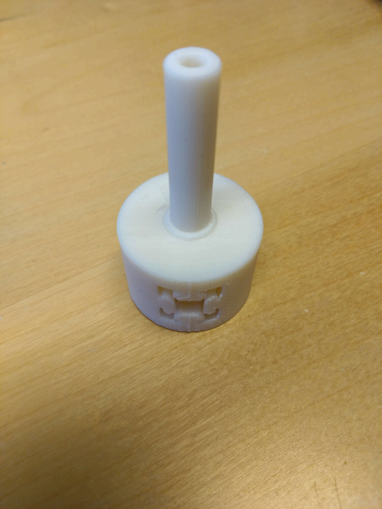|4x|22 g|lower elbow. Newer version has threaded on the side of the cylinder.|
|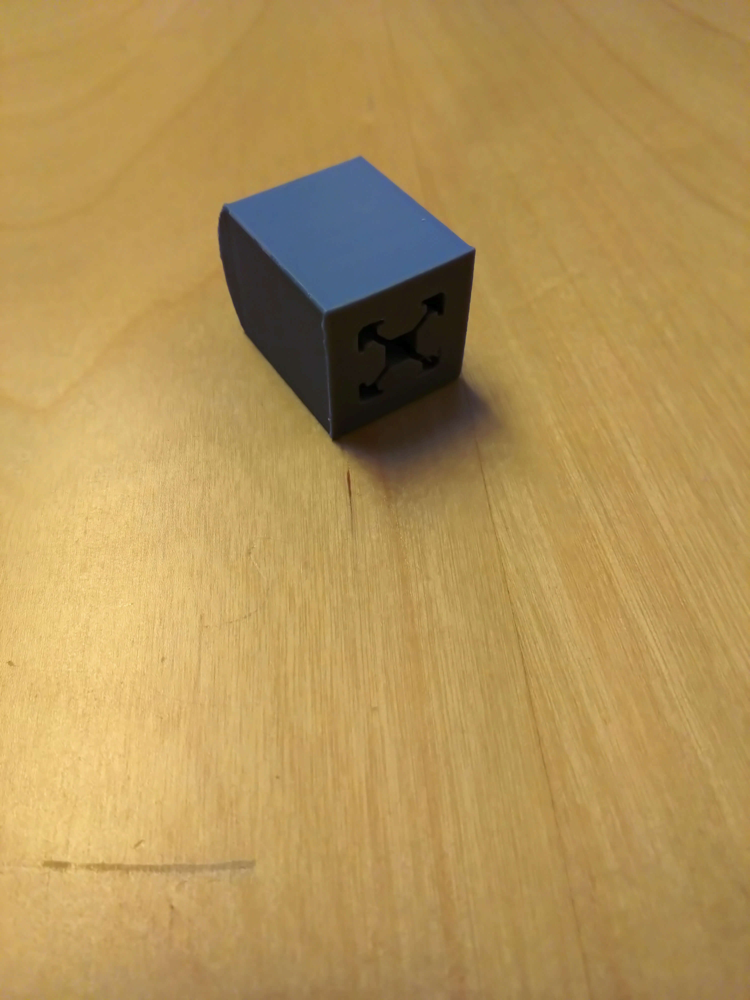|4x|19 g|foot|

*For a comparison between the ABS (white) and PLA (grey) plastics. A PLA-version of this part weights 46 g.

## Other parts
|Name|Qty.|Weight|Description|
|---|---|---|---|
|Raspberry Pi 4 Model B|1x|46g||
